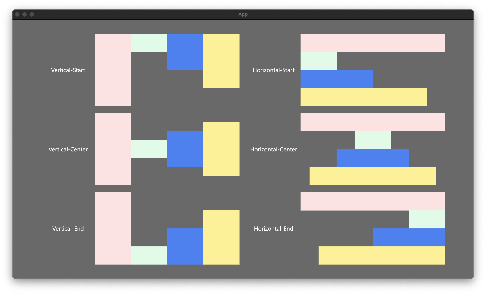
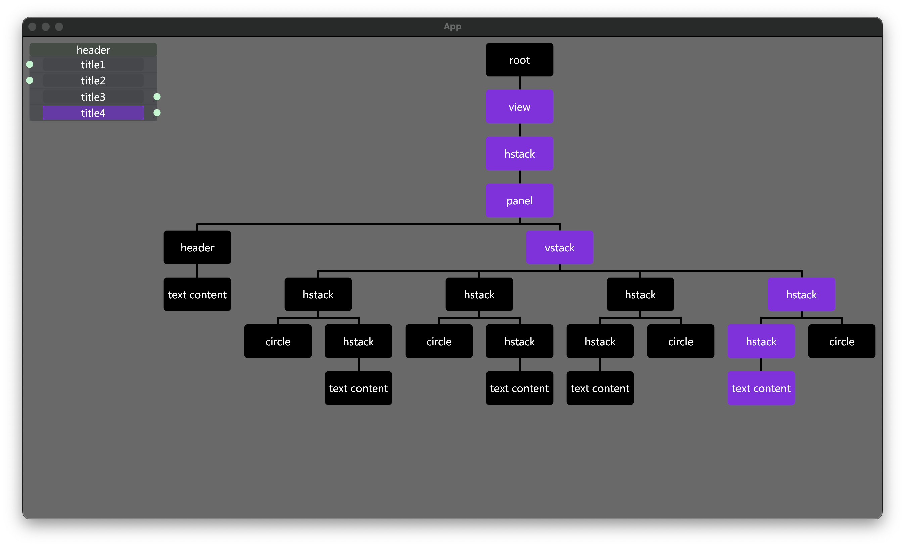

# Binaries

## What is Binaries?

Binaries is an **early-stage ui**, using **Bevy**, written in the Rust programming language.

This project's main goal is to provide **a solid foundation for developers to build on top of**, whether for graph display, or full-graph applications for 3D.

## Feature

### Layouts

### UIElement Tree VIew for DEBUG

